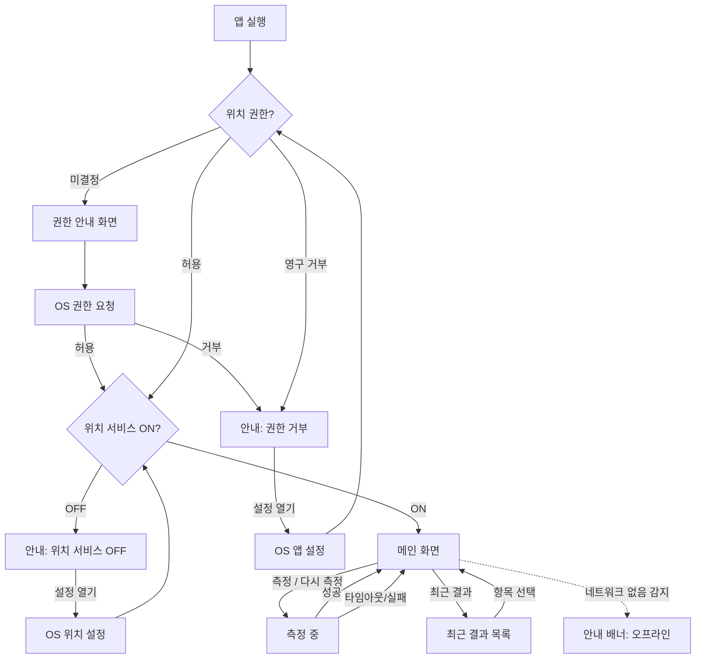

# PRD: 위치 측정 앱 (가칭 "Location Check")

| 항목 | 내용 |
|---|---|
| 문서 버전 | 0.2 (미결 사항 Q-1~Q-11 확정 반영) |
| 작성일 | 2026-09-04 (v0.1) / 2026-09-04 (v0.2) |
| 작성자 | 마클 (PM/아키텍트) |
| 상태 | 최종 승인 대기 — 승인 전까지 소스 코드 생성 없음 |

### 변경 이력
| 버전 | 일자 | 내용 |
|---|---|---|
| 0.1 | 2026-09-04 | 초안 작성. 플랫폼·배포·저장 범위 확정, 미결 사항 11건 제시 |
| 0.2 | 2026-09-04 | Q-1~Q-11 답변 반영. 호스팅·API 키 절차·기준값·최소 OS·타임아웃·앱 이름·색상·1차 범위 확정 |

---

## 1. 개요·목표·비목표

### 1.1 개요
스마트폰이 현재 있는 곳의 위도·경도 좌표를 구글맵 위에 표시하고, **측정 시점의 인터넷 연결이 WiFi인지 이동통신망(LTE/5G)인지**를 함께 표시하는 개인용 측정 앱입니다. 측정 결과는 기기 안에만 저장하며, 서버·계정·스토어 배포는 없습니다.

### 1.2 확정된 결정사항 (변경 금지)

| 항목 | 결정 |
|---|---|
| 대상 기기 | Android(삼성 포함) + iPhone |
| 플랫폼 | **Flutter 단일 코드베이스** |
| Android 배포 | `flutter build apk` 산출물을 개인 기기에 직접 설치(사이드로드) |
| iOS 배포 | 빌드용 Mac이 없으므로 **같은 Flutter 코드를 웹으로 빌드해 PWA로 배포**, iPhone Safari에서 "홈 화면에 추가" |
| PWA 호스팅 | **GitHub Pages** (HTTPS 자동) — Q-1 |
| 지도 | Google Maps — Android: `google_maps_flutter` (Maps SDK for Android) / iOS PWA: `google_maps_flutter_web` (Maps JavaScript API) |
| API 키 | **미보유** → 선생님이 직접 발급, 마클은 TASKS.md에 체크리스트 제공 (키 2종 필요) — Q-2 |
| 앱 이름 / 패키지명 | **"위치 측정"** / `com.tsdevel.locationcheck` — Q-9 |
| 최소 OS | **Android 10 (API 29) 이상 / iOS 16.4 이상 Safari** — Q-5 |
| 스토어 등록 | 없음 |
| UI 언어 | 한국어 |
| 저장 범위 | 기기 내 최근 50건, 로컬 전용 |
| 1차 범위 | Must + Should. Could(FR-16, FR-17, FR-18)는 1차 제외 — Q-11 |

### 1.3 용어 정의 (반드시 이 정의를 따름)

| 용어 | 정의 |
|---|---|
| **WiFi 기반** | 측정 시점의 인터넷 연결이 WiFi인 상태 |
| **LTE 기반** | 측정 시점의 인터넷 연결이 이동통신망(LTE/5G)인 상태 |
| **측위 출처 추정** | 보조 정보. 좌표가 GPS·WiFi AP·기지국 중 무엇으로 계산됐을지 추정한 값 |
| ↳ Android | 위치 제공자(`gps` / `network` / `fused`)와 오차반경(m)으로 추정 |
| ↳ iOS | 제공자 정보 없음 → 오차반경(m)으로만 추정. 기준값은 **GPS ≤ 20 m, WiFi 21~100 m, 기지국 > 100 m** (확정, Q-4. 상수로 분리해 실측 후 조정 가능) |

> "WiFi 기반/LTE 기반"은 **연결망**을 뜻하며, 좌표가 무엇으로 계산됐는지를 뜻하지 않습니다. 이 둘은 앱 화면에서도 별도 항목으로 분리해 표시합니다.

### 1.4 반드시 반영할 기술적 제약 (사실)

| # | 제약 | PRD 반영 위치 |
|---|---|---|
| C-1 | 스마트폰 위치는 GPS·WiFi AP·기지국 정보를 합산(Fused)해 계산되므로 "WiFi로 측정한 좌표"를 API로 분리해 얻을 수 없다. | 1.6 비목표, FR-07, 4절 |
| C-2 | iOS는 위치의 출처(WiFi/기지국/GPS)를 앱에 알려주지 않는다. | FR-07, 4절 |
| C-3 | 앱은 WiFi를 켜거나 끌 수 없다(Android 10+, iOS 모두). | 1.6 비목표, EX-15 |
| C-4 | 웹앱(PWA) 환경에서 iPhone Safari는 네트워크 종류 감지 API가 없다. | FR-06, 4절, EX-10 |

### 1.5 목표

| # | 목표 | 측정 지표 |
|---|---|---|
| G-1 | 버튼 한 번으로 현재 좌표를 지도 위에 마커+오차 원으로 표시 | 측정 시작 후 15초 이내 결과 표시 |
| G-2 | 측정 시점의 연결망(WiFi/LTE/5G/없음)을 좌표와 함께 기록 | Android에서 100% 판별, iOS PWA는 "알 수 없음"으로 정직하게 표시 |
| G-3 | 반복 측정 시 직전 결과와 거리(m)를 비교 | 소수점 1자리 m 단위 표시 |
| G-4 | 최근 50건을 기기에 보관, 앱 재실행 후에도 유지 | 재실행 후 목록 복원 |
| G-5 | 위치 서비스 OFF·권한 거부·오프라인 시 원인별 안내 | 3가지 상태 각각 전용 화면 |

### 1.6 비목표 (Non-goals)

- WiFi 자동 제어(켜기/끄기/전환) — C-3
- 실내 정밀측위(비콘, UWB, 층 구분 등)
- "WiFi로 측정한 좌표"와 "LTE로 측정한 좌표"를 API 수준에서 분리 취득 — C-1
- iOS 네이티브(App Store/Xcode) 빌드 — Mac 미보유
- 백그라운드 위치 추적, 연속 트래킹, 경로 기록
- 서버 동기화, 계정, 다중 기기 공유
- 스토어 배포, 다국어, 다크 모드 전용 디자인
- 좌표 정확도 자체를 높이는 기능(보정, 평균화)

---

## 2. 화면 흐름 및 화면별 요소

### 2.1 화면 흐름



### 2.2 화면별 요소

#### S1. 권한 안내 화면
| 요소 | 내용 |
|---|---|
| 제목 | "위치 권한이 필요합니다" |
| 본문 | 위치 권한이 필요한 이유(현재 좌표 측정), 앱 사용 중에만 사용, 저장은 기기 내에만 |
| 버튼 | [권한 허용하기] → OS 권한 요청 |
| 참고 | iOS PWA에서는 OS 팝업 대신 Safari 권한 팝업이 뜨며, 세션마다 재요청될 수 있음(8절 Q-6) |

#### S2. 메인 화면
| 영역 | 요소 | 상세 |
|---|---|---|
| 상단 앱바 | 제목, [최근 결과] 아이콘 | 목록 화면 S3로 이동 |
| 지도 영역 (화면 상단 ~55%) | Google Map | 최근 측정 좌표를 중심으로 표시, 기본 줌 17 |
| | 마커 | 측정 좌표. 연결망별 색 구분: WiFi=파랑, LTE/5G=주황, 없음/알 수 없음=회색 |
| | 오차반경 원 | 반지름 = accuracyM, 마커와 같은 색, 반투명 |
| | 이전 마커 (선택) | 직전 결과를 흐린 마커로 표시하고 현재 마커와 점선 연결 (Could) |
| 정보 패널 (하단 시트) | 위도 / 경도 | 소수점 6자리, 예: `37.566535, 126.977969` / 탭하면 클립보드 복사 |
| | 오차반경 | `± 12 m` |
| | 연결망 | `WiFi` / `LTE` / `5G` / `이동통신(기타)` / `없음` / `알 수 없음` |
| | 측위 출처 추정 | Android: `GPS (제공자 fused, ±8 m)` 형식 / iOS: `WiFi 추정 (±45 m)` 형식 |
| | 측정 시각 | `2026-09-04 14:03:21` (기기 로컬 시간) |
| | 이전 측정과 거리 | `직전 대비 3.4 m` (첫 측정 시 미표시) |
| | 상태 배지 | 측정 중 스피너 / 오프라인 배너 / 모의 위치 경고 |
| 하단 버튼 | [측정] 또는 [다시 측정] | 첫 측정 전에는 "측정", 결과가 하나라도 있으면 "다시 측정". 측정 중에는 비활성화 + "측정 중… (n초)" |

#### S3. 최근 결과 목록
| 요소 | 내용 |
|---|---|
| 리스트 항목 | 측정 시각, 연결망 배지, 위경도(6자리), 오차반경, 직전 대비 거리 |
| 정렬 | 최신순, 최대 50건 |
| 항목 탭 | 메인 화면으로 돌아가 해당 좌표를 지도 중앙에 표시 |
| 항목 스와이프 / 길게 누르기 | 단건 삭제 |
| 앱바 메뉴 | [전체 삭제] (확인 다이얼로그 필요) |
| 빈 상태 | "아직 측정 결과가 없습니다" |

#### E1. 안내: 위치 서비스 OFF
| 요소 | 내용 |
|---|---|
| 아이콘/제목 | "기기의 위치 서비스가 꺼져 있습니다" |
| 본문 | 설정에서 위치를 켠 뒤 다시 시도 |
| 버튼 | [위치 설정 열기] (Android: 위치 설정 화면 / iOS PWA: 설정 이동 불가 → 경로 안내 텍스트) / [다시 확인] |

#### E2. 안내: 위치 권한 거부
| 요소 | 내용 |
|---|---|
| 제목 | "위치 권한이 거부되었습니다" |
| 본문 | 일시 거부: 다시 요청 가능 / 영구 거부("다시 묻지 않음"): 앱 설정에서 직접 허용 필요 |
| 버튼 | 일시 거부: [다시 요청] / 영구 거부: [앱 설정 열기] / iOS PWA: Safari 설정 > 위치 경로 텍스트 안내 |

#### E3. 안내: 오프라인
| 요소 | 내용 |
|---|---|
| 형태 | 메인 화면 상단 **배너** (전체 화면 아님) |
| 문구 | "인터넷 연결이 없습니다. 지도는 표시되지 않지만 GPS 측정은 가능합니다." |
| 동작 | 측정 버튼은 활성 유지. 연결망 항목은 `없음`으로 기록. 지도 타일이 없어도 마커·좌표 텍스트는 표시 |

---

## 3. 기능 요구사항

우선순위: **Must**(없으면 출시 불가) / **Should**(1차 포함 권장) / **Could**(여유 시)

| ID | 우선순위 | 요구사항 | 합격 조건 |
|---|---|---|---|
| FR-01 | Must | 앱 실행 시 위치 권한 상태를 확인하고, 미결정이면 안내 화면(S1)을 거쳐 OS 권한을 요청한다. "앱 사용 중" 권한만 요청하고 백그라운드 권한은 요청하지 않는다. | 최초 실행 시 S1 → OS 팝업 순서로 표시 |
| FR-02 | Must | 위치 서비스(기기 설정)가 꺼져 있으면 E1 화면을 표시하고 설정으로 이동할 수 있는 버튼을 제공한다. | 위치 OFF 상태에서 실행 시 E1 표시 |
| FR-03 | Must | [측정] 버튼을 누르면 **고정밀 단발(single-shot)** 위치를 요청한다(Android `PRIORITY_HIGH_ACCURACY`, 웹 `enableHighAccuracy: true`). 타임아웃은 **15초**(확정, Q-8), 초과 시 마지막으로 수신한 위치가 있으면 그것을 결과로 사용하고 "타임아웃, 마지막 수신 위치" 표시, 없으면 실패 안내. | 야외에서 15초 내 결과 표시 |
| FR-04 | Must | 측정 결과를 지도 중앙 마커 + 오차반경 원으로 표시한다. 카메라는 마커로 이동한다. | 마커 위치 = 표시 좌표, 원 반지름 = accuracyM |
| FR-05 | Must | 정보 패널에 위도·경도(소수점 6자리), 오차반경(m, 정수), 연결망, 측위 출처 추정, 측정 시각을 표시한다. | 5개 항목 모두 표시 |
| FR-06 | Must | **연결망 판별**: 측정 시작 직전에 연결 종류를 조회해 결과에 기록한다.<br>• Android: `wifi` → `WiFi`, `mobile` → FR-06a, `none` → `없음`<br>• iOS PWA: Safari에 네트워크 종류 API가 없으므로(C-4) `navigator.onLine`으로 온/오프라인만 판별하고, 온라인이면 **`알 수 없음`** 으로 표시한다. 거짓으로 WiFi/LTE를 표시하지 않는다. | Android WiFi 연결 시 `WiFi`, 데이터 연결 시 `LTE`/`5G`, 비행기 모드 시 `없음`. iOS는 `알 수 없음`/`없음` |
| FR-06a | Should | Android에서 이동통신일 때 LTE와 5G를 구분한다. `TelephonyManager.dataNetworkType`을 MethodChannel로 조회하며, 이는 전화 상태 권한(Android 13+: `READ_BASIC_PHONE_STATE`, 이하: `READ_PHONE_STATE`)이 필요하다. 권한이 없거나 거부되면 구분하지 않고 **`이동통신`** 으로 표시한다. | LTE 강제 설정 시 `LTE`, 5G 연결 시 `5G`, 권한 거부 시 `이동통신` |
| FR-07 | Must | **측위 출처 추정**을 표시한다.<br>• Android: 위치 제공자 문자열(`gps`/`network`/`fused`)을 네이티브 `Location.provider`에서 MethodChannel로 조회한다(Flutter 위치 패키지는 제공자를 노출하지 않음). 제공자가 `gps`면 `GPS`, `network`면 오차반경 기준으로 `WiFi`/`기지국`, `fused`면 오차반경 기준으로 추정하고 "(제공자 fused)"를 병기.<br>• iOS PWA: 제공자 정보 없음(C-2) → 오차반경 기준으로만 추정: ≤20 m `GPS 추정`, 21~100 m `WiFi 추정`, >100 m `기지국 추정`.<br>• 어느 경우든 "추정"이라는 단어를 UI에 붙여 확정값이 아님을 표시한다. | Android 야외에서 `GPS`, iOS 야외에서 `GPS 추정 (≤20 m)` |
| FR-08 | Must | [다시 측정] 시 직전 결과와의 거리를 Haversine 공식으로 계산해 m 단위 소수점 1자리로 표시한다. | 같은 자리 재측정 시 오차반경 이내 값 |
| FR-09 | Must | 측정 결과를 기기 로컬 저장소에 최근 **50건**까지 저장한다(초과 시 가장 오래된 것부터 삭제). 앱 재실행 후 목록과 마지막 결과를 복원한다. Android는 앱 로컬 저장소, iOS PWA는 브라우저 저장소(localStorage)를 사용한다. | 재실행 후 50건 유지, 51번째 측정 시 1번째 삭제 |
| FR-10 | Must | 최근 결과 목록(S3)에서 항목 선택 시 지도에 표시하고, 단건 삭제·전체 삭제를 제공한다. 전체 삭제는 확인 다이얼로그를 거친다. | 삭제 후 목록·저장소 모두 반영 |
| FR-11 | Must | 위치 권한 거부 시 일시 거부와 영구 거부를 구분해 E2 화면을 표시한다. | 영구 거부 시 [앱 설정 열기] 표시 |
| FR-12 | Must | 오프라인이면 E3 배너를 표시하되 측정은 계속 허용한다. 지도 타일이 없어도 좌표 텍스트와 마커를 표시한다. | 비행기 모드+GPS ON에서 측정 성공, 연결망 `없음` |
| FR-13 | Should | Android에서 모의 위치(`Location.isMock`, API 31+)가 감지되면 결과에 "모의 위치" 경고 배지를 표시하고 저장 시 플래그를 남긴다. | 모의 위치 앱 사용 시 배지 표시 |
| FR-14 | Should | 위도·경도 텍스트를 탭하면 `위도, 경도` 형식으로 클립보드에 복사한다. | 복사 후 스낵바 표시 |
| FR-15 | Should | 측정 중 경과 시간을 초 단위로 표시하고, 버튼을 비활성화해 중복 요청을 막는다. | 측정 중 두 번 눌러도 요청 1회 |
| FR-16 | Could | 직전 결과 마커를 흐리게 표시하고 현재 마커와 점선으로 연결한다. | 두 마커·선 표시 |
| FR-17 | Could | 최근 결과 목록을 CSV로 내보내기(공유 시트)한다. | 50건 CSV 생성 |
| FR-18 | Could | iOS PWA 첫 실행 시 "홈 화면에 추가" 안내와 HTTPS·권한 관련 도움말을 표시한다. | Safari 브라우저 모드에서만 표시 |

### 3.1 비기능 요구사항

| ID | 내용 |
|---|---|
| NFR-01 | 측정 결과·좌표는 기기 밖으로 전송하지 않는다(지도 타일 요청 제외). |
| NFR-02 | Google Maps API 키는 소스 저장소에 평문으로 커밋하지 않는다(Android: `local.properties`/manifest placeholder, 웹: 빌드 시 주입). |
| NFR-03 | 최소 지원 버전(확정, Q-5): Android 10 (API 29) 이상, iOS 16.4 이상 Safari(PWA 위치 권한 안정화 버전). |
| NFR-05 | PWA는 GitHub Pages(HTTPS)에 배포한다(Q-1). Flutter 웹 빌드 시 `--base-href`를 저장소 경로에 맞춘다. |
| NFR-04 | 앱 크기·성능 목표 없음(개인용). 다만 측정 버튼 응답은 100 ms 이내에 "측정 중" 상태로 전환. |

---

## 4. 플랫폼별 차이표

| 항목 | Android (Flutter 네이티브 APK) | iOS (Flutter 웹 → PWA, Safari) |
|---|---|---|
| 설치 방식 | APK 사이드로드("출처를 알 수 없는 앱" 허용) | HTTPS로 호스팅된 웹앱을 Safari에서 열고 "홈 화면에 추가" |
| 위치 API | Android `FusedLocationProviderClient` (Flutter `geolocator` 경유) | 브라우저 `navigator.geolocation` (`geolocator_web` 경유) |
| 위경도·오차반경 | 취득 가능 | 취득 가능 |
| 위치 제공자(gps/network/fused) | 취득 가능 (MethodChannel 필요) | **불가** (C-2, 브라우저도 미제공) |
| 측위 출처 추정 | 제공자 + 오차반경 | 오차반경만 |
| 연결망 종류(WiFi/모바일/없음) | 취득 가능 (`connectivity_plus`) | **불가** (C-4). `navigator.onLine`으로 온/오프라인만 판별 → `알 수 없음` 표시 |
| LTE vs 5G 구분 | 가능 (전화 상태 권한 + `TelephonyManager`) | 불가 |
| 모의 위치 감지 | 가능 (API 31+ `isMock`) | 불가 |
| 지도 SDK | Maps SDK for Android (`google_maps_flutter`) | Maps JavaScript API (`google_maps_flutter_web`) |
| API 키 | Android 키 (앱 패키지명+SHA-1 제한) | 웹 키 (HTTP 리퍼러 제한) |
| 오프라인 시 지도 | 캐시된 타일 일부 표시 가능 | 타일 표시 불가, 지도 영역 빈 화면 |
| 오프라인 시 측정 | 가능(GPS) | 가능(GPS), 단 PWA 셸이 Service Worker에 캐시돼 있어야 실행 가능 |
| 권한 지속성 | 한 번 허용하면 유지 | 홈 화면 PWA는 대체로 유지되나 세션마다 재요청될 수 있음(8절 Q-6) |
| OS 설정 화면 이동 | 가능 (`openAppSettings`, `openLocationSettings`) | 불가 → 경로 안내 텍스트로 대체 |
| 로컬 저장소 | `shared_preferences` (SharedPreferences) | `shared_preferences` (localStorage). Safari가 미사용 데이터를 일정 기간 후 삭제할 수 있음 |
| 클립보드 | 가능 | 가능 (사용자 제스처 내에서만) |
| 시간 | 기기 로컬 시간 | 기기 로컬 시간 |
| 빌드 환경 | Windows에서 `flutter build apk` | Windows에서 `flutter build web` → 정적 호스팅에 업로드 |

---

## 5. 권한·오류·예외 처리 표

| ID | 상황 | 감지 방법 | 앱 동작 | 사용자 안내 문구(안) |
|---|---|---|---|---|
| EX-01 | 위치 권한 미결정(최초) | 권한 상태 `denied`(요청 전) | S1 안내 → OS 요청 | "위치 권한이 필요합니다" |
| EX-02 | 위치 권한 일시 거부 | `denied` | E2 표시, [다시 요청] | "위치 권한이 거부되었습니다. 다시 요청하시겠어요?" |
| EX-03 | 위치 권한 영구 거부 | Android `deniedForever` / iOS PWA는 구분 불가 → 거부 2회 이상 시 영구로 간주 | E2 표시, [앱 설정 열기](Android) / 경로 안내(iOS) | "설정 > 앱 > 위치 에서 허용해 주세요" |
| EX-04 | 위치 서비스 OFF | `isLocationServiceEnabled() == false` | E1 표시, [위치 설정 열기] | "기기의 위치 서비스가 꺼져 있습니다" |
| EX-05 | 대략적 위치만 허용(Android 12+) | 권한은 허용이나 정확도 `approximate` | 측정은 진행하되 "대략적 위치 모드, 오차 큼" 배지 표시 | "정확한 위치 권한이 꺼져 있어 오차가 큽니다" |
| EX-06 | 오프라인 | `connectivity == none` / `navigator.onLine == false` | E3 배너, 측정 허용, 연결망 `없음` 기록 | "인터넷 연결이 없습니다. 지도는 표시되지 않지만 GPS 측정은 가능합니다" |
| EX-07 | 측정 타임아웃(15초) | 위치 스트림 타임아웃 | 마지막 수신 위치가 있으면 사용 + "타임아웃" 배지, 없으면 실패 스낵바 | "위치를 찾지 못했습니다. 하늘이 보이는 곳에서 다시 시도해 주세요" |
| EX-08 | 위치 취득 실패(예외) | 플랫폼 예외 | 실패 스낵바, 이전 결과 유지 | "측정에 실패했습니다 (오류 코드)" |
| EX-09 | 전화 상태 권한 거부(Android) | `READ_(BASIC_)PHONE_STATE` 거부 | LTE/5G 구분 생략, `이동통신`으로 표시. 재요청은 1회만 | "네트워크 세대(LTE/5G) 구분을 위해 전화 상태 권한이 필요합니다. 거부해도 측정은 가능합니다" |
| EX-10 | iOS PWA 연결망 감지 불가 | 플랫폼이 웹+iOS | 연결망 `알 수 없음` 고정 표시, 툴팁으로 이유 설명 | "iPhone 웹앱에서는 WiFi/LTE 구분을 제공하지 않습니다" |
| EX-11 | 모의 위치 감지(Android 12+) | `Location.isMock == true` | 경고 배지, `isMock=true` 저장 | "모의 위치가 감지되었습니다" |
| EX-12 | Google Maps 로드 실패(키 오류·쿼터) | 지도 위젯 오류 콜백 / 웹 콘솔 오류 | 지도 영역에 오류 메시지, 좌표 텍스트는 정상 표시 | "지도를 불러오지 못했습니다 (API 키 확인)" |
| EX-13 | PWA가 HTTP로 열림 | `window.location.protocol != 'https:'` (localhost 제외) | 위치 API 자체가 차단되므로 전체 화면 안내 | "이 앱은 HTTPS 주소에서만 동작합니다" |
| EX-14 | 저장소 쓰기 실패(용량·Safari 삭제) | 예외 / 읽기 결과 없음 | 측정 결과는 화면에 유지, 저장 실패 스낵바 | "결과를 저장하지 못했습니다" |
| EX-15 | WiFi 제어 요청 | 해당 없음 | 앱은 WiFi를 켜거나 끄지 않는다(C-3). 관련 UI 없음 | — |
| EX-16 | 삼성 배터리 최적화로 위치 지연 | 타임아웃으로 간접 감지 | EX-07과 동일 + 도움말에 "배터리 최적화 제외" 안내 | 8절 Q-7 |

### 5.1 요청할 권한 목록

| 플랫폼 | 권한 | 용도 | 필수 |
|---|---|---|---|
| Android | `ACCESS_FINE_LOCATION`, `ACCESS_COARSE_LOCATION` | 좌표 측정 | Must |
| Android | `ACCESS_NETWORK_STATE` | 연결망 종류 | Must (설치 시 자동) |
| Android | `READ_BASIC_PHONE_STATE` (API 33+) / `READ_PHONE_STATE` (API 29~32) | LTE/5G 구분 | Should |
| Android | `INTERNET` | 지도 타일 | Must |
| iOS PWA | 브라우저 위치 권한 | 좌표 측정 | Must |
| 요청하지 않음 | 백그라운드 위치, `CHANGE_WIFI_STATE`, 연락처 등 | — | — |

---

## 6. 데이터 모델

### 6.1 측정 결과 (`Measurement`) — 1건

| 필드 | 타입 | 필수 | 설명 | 예시 |
|---|---|---|---|---|
| `id` | String (UUID v4) | ✔ | 고유 식별자 | `"3f2a…"` |
| `measuredAt` | String (ISO 8601, 로컬 오프셋 포함) | ✔ | 측정 시각 | `"2026-09-04T14:03:21+09:00"` |
| `latitude` | double | ✔ | 위도 (저장은 원본, 표시는 6자리) | `37.566535` |
| `longitude` | double | ✔ | 경도 | `126.977969` |
| `accuracyM` | double | ✔ | 수평 오차반경(m) | `12.0` |
| `connectionType` | enum | ✔ | `wifi` / `lte` / `fiveG` / `mobileOther` / `none` / `unknown` | `"wifi"` |
| `locationProvider` | String? | – | Android만: `gps` / `network` / `fused`. iOS는 null | `"fused"` |
| `sourceEstimate` | enum | ✔ | `gps` / `wifi` / `cell` / `unknown` — FR-07 규칙으로 계산 | `"gps"` |
| `platform` | enum | ✔ | `android` / `iosWeb` | `"android"` |
| `distanceFromPrevM` | double? | – | 직전 결과와의 거리(m). 첫 건은 null | `3.4` |
| `isMock` | bool? | – | Android 12+ 모의 위치 여부. 그 외 null | `false` |
| `timedOut` | bool | ✔ | 타임아웃 후 마지막 수신 위치를 사용했는지 | `false` |
| `altitudeM` | double? | – | 고도(m), 참고용 | `38.2` |
| `appVersion` | String | ✔ | 측정 당시 앱 버전 | `"0.1.0"` |

### 6.2 측위 출처 추정 규칙 (`sourceEstimate` 계산)

```
if platform == android and locationProvider == "gps"      → gps
if platform == android and locationProvider == "network"  → (accuracyM <= 100 ? wifi : cell)
else (fused 또는 iOS):
    accuracyM <= 20   → gps
    accuracyM <= 100  → wifi
    accuracyM >  100  → cell
accuracyM 없음        → unknown
```
기준값 20 m / 100 m는 확정값입니다(Q-4). 코드에서는 상수로 분리해 실측 후 조정할 수 있게 합니다.

### 6.3 저장소

| 항목 | 내용 |
|---|---|
| 저장 위치 | `shared_preferences` 키 `measurements` 에 JSON 배열 문자열로 저장 (Android: SharedPreferences, 웹: localStorage) |
| 최대 건수 | 50 (초과 시 가장 오래된 항목부터 삭제) |
| 정렬 | 배열 앞쪽이 최신 |
| 용량 추정 | 1건 약 400 B × 50 = 약 20 KB (localStorage 한도 5 MB 대비 충분) |
| 마이그레이션 | 배열 옆에 `schemaVersion: 1` 저장. 필드 추가 시 기본값으로 채움 |
| 삭제 | 단건 삭제, 전체 삭제(확인 후) |

---

## 7. 테스트 시나리오와 합격 기준

모든 시나리오는 Android(삼성)와 iPhone(PWA) 각각 수행합니다. iOS는 연결망이 항상 `알 수 없음`이므로 연결망 열의 iOS 기대값은 별도로 표기합니다.

### 7.1 정상 시나리오 (연결망 × 환경)

| ID | 조건 | 절차 | 기대 결과 (Android) | 기대 결과 (iOS PWA) | 합격 기준 |
|---|---|---|---|---|---|
| T-01 | **WiFi 연결 / 야외** (하늘이 트인 곳, 모바일 데이터 OFF) | 앱 실행 → 측정 | 연결망 `WiFi`, 출처 `GPS`(제공자 gps 또는 fused ≤20 m), 오차 ≤ 20 m | 연결망 `알 수 없음`, 출처 `GPS 추정`, 오차 ≤ 20 m | 15초 내 결과, 마커가 실제 위치 30 m 이내 |
| T-02 | **WiFi 연결 / 실내** (창가 아닌 곳) | 측정 | 연결망 `WiFi`, 출처 `WiFi` 또는 `기지국`(오차 20~150 m) | 연결망 `알 수 없음`, 출처 `WiFi 추정` 또는 `기지국 추정` | 15초 내 결과 또는 타임아웃 배지, 앱 크래시 없음 |
| T-03 | **LTE 연결 / 야외** (WiFi OFF) | 측정 | 연결망 `LTE`(또는 권한 거부 시 `이동통신`), 출처 `GPS`, 오차 ≤ 20 m | 연결망 `알 수 없음`, 출처 `GPS 추정` | T-01과 동일 |
| T-04 | **LTE 연결 / 실내** | 측정 | 연결망 `LTE`, 출처 `WiFi`/`기지국`(WiFi OFF여도 주변 AP 스캔으로 WiFi 추정 가능) | 연결망 `알 수 없음`, 출처 오차반경 기준 | T-02와 동일 |
| T-05 | 5G 연결 / 야외 (Android, 5G 지역) | 측정 | 연결망 `5G` | 해당 없음 | 5G 표시 |
| T-06 | 다시 측정 / 제자리 | T-01 후 30초 대기 → 다시 측정 | 직전 대비 거리 ≤ (두 오차반경 합) | 동일 | 거리 값 표시, 단위 m, 소수점 1자리 |
| T-07 | 다시 측정 / 이동 후 | 약 50 m 걷고 다시 측정 | 직전 대비 거리 30~70 m | 동일 | 거리가 이동 거리 ±20 m |
| T-08 | 저장·복원 | 측정 3회 → 앱 종료 → 재실행 | 목록에 3건, 마지막 결과 지도 표시 | 동일 (Safari 데이터 삭제 안 한 경우) | 3건 보존 |
| T-09 | 50건 상한 | 51회 측정(또는 테스트용 더미 주입) | 목록 50건, 가장 오래된 것 삭제 | 동일 | 정확히 50건 |
| T-10 | 삭제 | 단건 삭제, 전체 삭제 | 목록·저장소 반영, 전체 삭제 시 확인 다이얼로그 | 동일 | 재실행 후에도 삭제 유지 |

### 7.2 예외 시나리오

| ID | 조건 | 절차 | 기대 결과 | 합격 기준 |
|---|---|---|---|---|
| T-11 | 위치 서비스 OFF | 기기 위치 끄기 → 앱 실행 | E1 화면, [위치 설정 열기] 동작(Android) / 경로 안내(iOS) | 위치 켠 뒤 [다시 확인]으로 메인 진입 |
| T-12 | 권한 일시 거부 | 최초 실행 시 거부 | E2 화면, [다시 요청] 시 OS 팝업 재표시 | 허용 후 메인 진입 |
| T-13 | 권한 영구 거부(Android) | 두 번 거부 또는 "다시 묻지 않음" | E2 화면, [앱 설정 열기]로 설정 이동 | 설정에서 허용 후 복귀 시 메인 진입 |
| T-14 | 오프라인 | 비행기 모드 + 위치 ON → 측정 | E3 배너, 측정 성공(GPS), 연결망 `없음`, 지도 타일 없어도 좌표 텍스트 표시 | 크래시 없음, 결과 저장됨 |
| T-15 | 타임아웃 | 지하 주차장 등에서 측정 | 15초 후 타임아웃 배지 또는 실패 스낵바 | 버튼이 다시 활성화됨 |
| T-16 | 전화 상태 권한 거부(Android) | FR-06a 권한 거부 후 LTE로 측정 | 연결망 `이동통신` | 측정 자체는 성공 |
| T-17 | 모의 위치(Android) | 모의 위치 앱 설정 후 측정 | "모의 위치" 배지, `isMock=true` | 배지 표시 |
| T-18 | 지도 키 오류 | 잘못된 키로 빌드 | 지도 오류 표시, 좌표·측정 기능은 정상 | 크래시 없음 |
| T-19 | PWA HTTP 접속(iOS) | http:// 주소로 열기 | EX-13 전체 화면 안내 | 위치 요청 시도 안 함 |
| T-20 | 측정 중 중복 탭 | 측정 중 버튼 연타 | 요청 1회, 버튼 비활성 | 결과 1건만 저장 |

### 7.3 전체 합격 기준
- Must 요구사항(FR-01~FR-12)에 해당하는 T-01~T-04, T-06, T-08~T-15, T-20이 Android에서 모두 통과
- iOS PWA에서는 연결망 `알 수 없음` 표시를 전제로 동일 시나리오 통과 (T-05, T-13, T-16, T-17 제외)
- 어떤 시나리오에서도 앱 크래시·무한 로딩이 없음

---


## 8. 미결 사항 및 확인 질문

### 8.1 확정된 결정 기록 (v0.1 Q-1~Q-11 → v0.2 반영)

| ID | 질문 | 확정 답변 | 반영 위치 |
|---|---|---|---|
| Q-1 | PWA 호스팅 위치 | **GitHub Pages** (HTTPS 자동) | 1.2, NFR-05, EX-13 |
| Q-2 | Google Maps API 키 발급 주체 | **선생님 직접 발급**, 마클은 TASKS.md에 체크리스트 제공. 필요 항목: Google Cloud 프로젝트 → "Maps SDK for Android" + "Maps JavaScript API" 활성화 → 키 2개 생성(Android 키: 패키지명 `com.tsdevel.locationcheck` + SHA-1 제한, 웹 키: GitHub Pages 주소 HTTP 리퍼러 제한) → 결제 계정 연결(무료 한도 내) | 1.2, NFR-02, EX-12 |
| Q-3 | LTE/5G 구분용 전화 상태 권한 요청 | **포함** (FR-06a Should 유지, 권한 팝업 최초 1회, 거부 시 `이동통신` 표시) | FR-06a, EX-09, 5.1 |
| Q-4 | 측위 출처 추정 기준값 | **GPS ≤ 20 m / WiFi 21~100 m / 기지국 > 100 m** 확정. 상수로 분리 | 1.3, FR-07, 6.2 |
| Q-5 | 최소 OS 버전 | **Android 10 (API 29) 이상 / iOS 16.4 이상** | 1.2, NFR-03 |
| Q-6 | iOS PWA 한계 수용 | **수용**. 위치 권한 세션마다 재요청 가능, 장기 미사용 시 저장 데이터 삭제 가능. 도움말(FR-18)에 명시 | S1 참고, 4절, EX-14 |
| Q-7 | 삼성 배터리 최적화 안내 | **넣지 않음**. 도움말 텍스트만 | EX-16 |
| Q-8 | 측정 타임아웃·정확도 모드 | **15초 / 고정밀(best)** | FR-03, EX-07 |
| Q-9 | 앱 이름·패키지명 | **"위치 측정"** / `com.tsdevel.locationcheck` | 1.2 |
| Q-10 | 연결망별 마커 색상 | **WiFi 파랑 / LTE·5G 주황 / 없음·알 수 없음 회색** | S2 |
| Q-11 | FR-16, FR-17 1차 포함 여부 | **둘 다 1차 제외**, Could 유지 | 1.2, 3절 |

### 8.2 남은 미결 사항

구현 단계에서 선생님의 조치가 필요한 항목입니다. PRD 승인 자체를 막지는 않습니다.

| ID | 항목 | 필요한 조치 | 시점 |
|---|---|---|---|
| O-1 | Google Maps API 키 2종 | 선생님이 Q-2 절차대로 발급 후 `local.properties`(Android)와 웹 빌드 환경 변수에 입력 | 지도 화면 구현 단계 전 |
| O-2 | GitHub Pages 저장소 | 저장소 이름·공개 여부 결정(공개 저장소 또는 유료 계정 비공개 저장소). 최종 주소가 웹 API 키 리퍼러 제한과 `--base-href`에 사용됨 | iOS PWA 배포 단계 전 |
| O-3 | Android 서명 SHA-1 | 디버그 키스토어 SHA-1을 Android API 키 제한에 등록(릴리스 키스토어 사용 시 그 SHA-1도 등록) | 지도 화면 구현 단계 전 |
| O-4 | 테스트 기기 정보 | 실제 삼성 기기 모델·Android 버전, iPhone 모델·iOS 버전. 7절 테스트 시 기록 | 테스트 단계 |
| O-5 | 실측 후 기준값 조정 | 6.2 기준값(20 m / 100 m)이 실측과 맞지 않으면 상수만 조정 | 테스트 단계 후 |

### 8.3 다음 단계 (PRD v0.2 승인 후)
1. `CLAUDE.md` 작성 (프로젝트 규칙, Flutter 버전, 빌드 명령, API 키 취급 규칙)
2. `docs/TASKS.md` 작업 체크리스트 작성 (O-1~O-3 절차 포함)
3. 단계별 구현 (승인 전까지 소스 코드 생성 없음)
